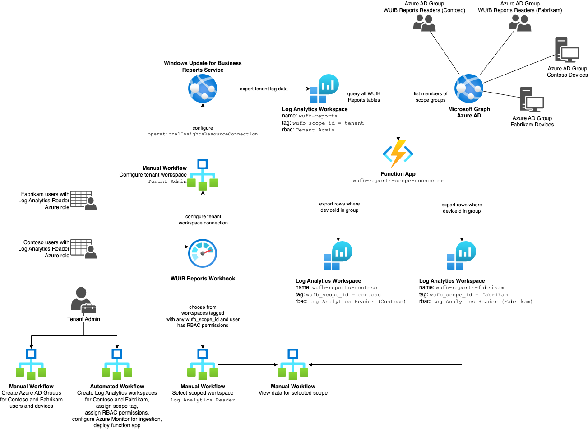

# WUfB Reports Access Control

## Overview

This solution deploys WUfB reports infrastructure for partioning data and securing access using Azure RBAC. As an administrator you can define one or more *scopes* to indicate that records for a given Azure AD group of devices should be exported from the tenant workspace to a scoped workspace that can be secured using Azure RBAC.

The `ansible` folder of the project contains an [Ansible](https://www.ansible.com) playbook which, after configuration, can deploy the necessary infrastructure to your Azure tenant.

At the high-level, this includes the following resources:

1. Azure resources
   1. [Resource group](https://learn.microsoft.com/en-us/azure/azure-resource-manager/management/manage-resource-groups-portal) to contain resources generated by the automation
   2. [Azure Function](https://learn.microsoft.com/en-us/azure/azure-functions/functions-overview) triggered on an interval to perform periodic data export
2. Log Analytics resources
   1. [Log Analytics workspace](https://learn.microsoft.com/en-us/azure/azure-monitor/logs/log-analytics-workspace-overview) for each scope
3. Azure Monitor resources
   1. [Data collection endpoint](https://learn.microsoft.com/en-us/azure/azure-monitor/essentials/data-collection-endpoint-overview) ingesting data
   2. [Data collection rule](https://learn.microsoft.com/en-us/azure/azure-monitor/essentials/data-collection-rule-overview) for each scoped workspace to direct data routing

All access groups will use the same Azure Monitor Workbook. WUfB reports has been updated to provide a drop-down workspace chooser.

## Architecture



## Permissions required for deployment

The user or [service principal](https://learn.microsoft.com/en-us/azure/active-directory/develop/app-objects-and-service-principals#service-principal-object) running the automation to deploy infrastructure should be an Azure subscription [Owner](https://learn.microsoft.com/en-us/azure/role-based-access-control/built-in-roles#owner) to ensure necessary providers and resources can be enabled automatically.

## Authorization

### Create a service principal

### Authorize service principal for subscription

- Access control (IAM)
  - Add role assignment. Needs Owner to have permission to assign RBAC to other resources created.

### Authorize service principal for Graph APIs

- Application.ReadWrite.OwnedBy
- GroupMember.Read.All

### Generate client secret

### Add credentials file

https://docs.ansible.com/ansible/latest/scenario_guides/guide_azure.html#storing-in-a-file

```ini
[default]
subscription_id=xxxxxxx-xxxx-xxxx-xxxx-xxxxxxxxxxxx
client_id=xxxxxxx-xxxx-xxxx-xxxx-xxxxxxxxxxxx
secret=xxxxxxxxxxxxxxxxx
tenant=xxxxxxx-xxxx-xxxx-xxxx-xxxxxxxxxxxx
```

## Ansible

### Install Azure collection and pre-requisites

```bash
ansible-galaxy collection install azure.azcollection
pip install -r ~/.ansible/collections/ansible_collections/azure/azcollection/requirements-azure.txt
```

### Install Node.js 18

### Install Azure function core tools

https://github.com/Azure/azure-functions-core-tools

#### Windows

```bash
npm i -g azure-functions-core-tools@4 --unsafe-perm true
```

#### Mac

```bash
brew tap azure/functions
brew install azure-functions-core-tools@4
```

### Login to Azure

- For authentication with Azure you can pass parameters, set environment variables, use a profile stored in ~/.azure/credentials, or log in before you run your tasks or playbook with `az login`.
- Authentication is also possible using a service principal or Active Directory user.
- To authenticate via service principal, pass subscription_id, client_id, secret and tenant or set environment variables AZURE_SUBSCRIPTION_ID, AZURE_CLIENT_ID, AZURE_SECRET and AZURE_TENANT.
- To authenticate via Active Directory user, pass ad_user and password, or set AZURE_AD_USER and AZURE_PASSWORD in the environment.
- Alternatively, credentials can be stored in `~/.azure/credentials`. This is an ini file containing a `[default]` section and the following keys: subscription_id, client_id, secret and tenant or subscription_id, ad_user and password. It is also possible to add additional profiles. Specify the profile by passing profile or setting AZURE_PROFILE in the environment.

### Configure secure vars

Add `scope_connector_credentials.yml` to `secure_vars`.

### Customize host vars

Customize scopes and other vars in `host_vars/localhost`.

### Run the playbook

```bash
ansible-playbook -i inventory site.yml
```

### Waiting for resources to be ready

```yaml
    - name: Wait for namespace to be ready
      azure_rm_resource_facts:
        api_version: '2017-04-01'
        resource_group: "{{ resource_group }}"
        provider: eventhub
        resource_type: namespaces
        resource_name: "{{ namespacename }}"
      register: output
      until: output.response[0].properties.status == 'Active'
      delay: 10
```

## Contributing

This project welcomes contributions and suggestions.  Most contributions require you to agree to a
Contributor License Agreement (CLA) declaring that you have the right to, and actually do, grant us
the rights to use your contribution. For details, visit https://cla.opensource.microsoft.com.

When you submit a pull request, a CLA bot will automatically determine whether you need to provide
a CLA and decorate the PR appropriately (e.g., status check, comment). Simply follow the instructions
provided by the bot. You will only need to do this once across all repos using our CLA.

This project has adopted the [Microsoft Open Source Code of Conduct](https://opensource.microsoft.com/codeofconduct/).
For more information see the [Code of Conduct FAQ](https://opensource.microsoft.com/codeofconduct/faq/) or
contact [opencode@microsoft.com](mailto:opencode@microsoft.com) with any additional questions or comments.

## Trademarks

This project may contain trademarks or logos for projects, products, or services. Authorized use of Microsoft 
trademarks or logos is subject to and must follow 
[Microsoft's Trademark & Brand Guidelines](https://www.microsoft.com/en-us/legal/intellectualproperty/trademarks/usage/general).
Use of Microsoft trademarks or logos in modified versions of this project must not cause confusion or imply Microsoft sponsorship.
Any use of third-party trademarks or logos are subject to those third-party's policies.
